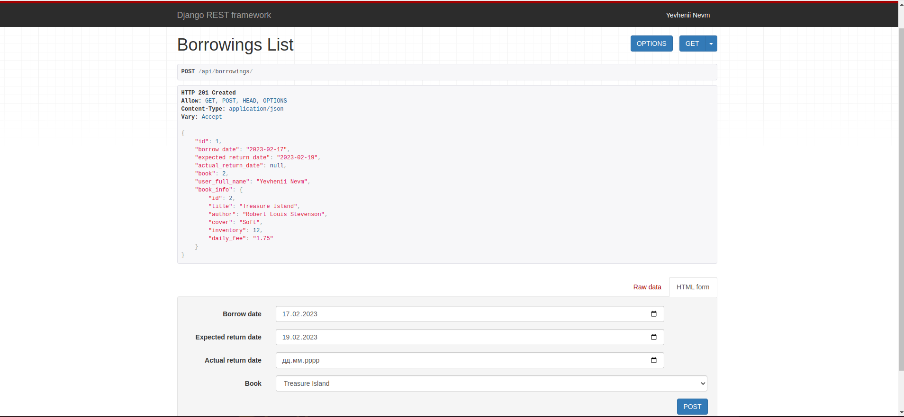
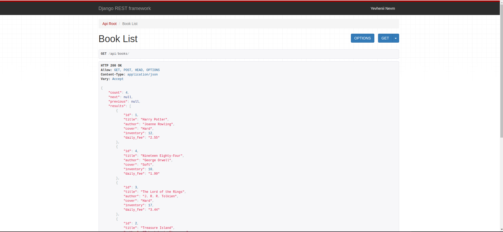

# library-service
Project API service for managing and borrowing books in library.

## Features
- JWT authentication
- Admin panel /admin/
- Documentation is located at /api/doc/swagger/
- Managing books and borrowing in service
- Creating user at /api/users/
- Login user at /api/users/token/
- Creating books at /api/books/
- Detail books info at /api/books/<pk>/
- Creating borrowings at /api/borrowings/
- Borrowings detail at api/borrowings/<pk>
- Return borrowing book at api/borrowings/<pk>/return_book
- Notification by Telegram Bot
- Celery task to overdue borrowing by Redis broker
- Using Flower to track the celery tasks by /0.0.0.0:5555/
- Run PR in docker




## Installing using GitHub
```bash
git clone https://github.com/yevhenii-nevmyvako/library-service
cd library_service
python -m venv venv
sourve venv/bin/activate
pip install -r requirements.txt
````

### Run on local server
- Install PostgreSQL, create DB and User
- Connect DB
- Run:
```bash
python manage.py makemigrations
python manage.py migrate
python manage.py runserver
```

### Run with Docker
Docker should be already installed
```bash
docker-compose build
docker-compose up
```

### Create/Authenticate User
```bash
- Path to create user api/users
- Path to login user api/users/token
- Authorization Berer
- docker exec -it container_id python manage.py createsuperuser
```

### Stop server:
```bash
dokcer-compose down
```
